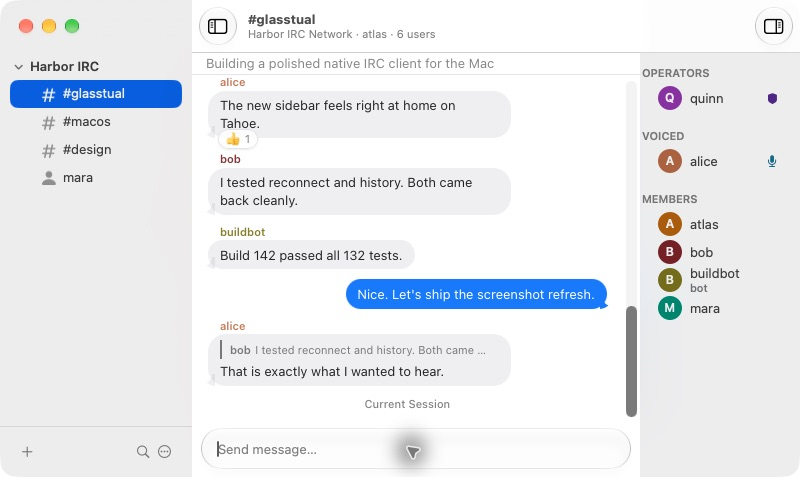
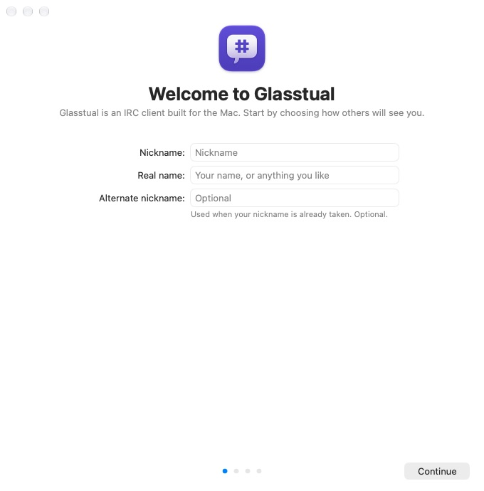

<p align="center">
  
</p>

<h1 align="center">Glasstual</h1>

<p align="center">
  A highly customizable IRC client for macOS 26 and later.
</p>

Glasstual is a highly customizable app for interacting with Internet Relay Chat (IRC) chatrooms on macOS.

Glasstual can be customized with styles written in CSS, HTML, and JavaScript; plugins written in Objective-C & Swift; and scripts written in AppleScript (plus many other languages).

## Relationship to Textual

**Glasstual is a fork and continuation of [Textual](https://github.com/Codeux-Software/Textual)**, the IRC client by Codeux Software, LLC. Upstream Textual is no longer actively maintained — it had a single full-time maintainer for the life of the project, who has since moved on. Everyone who contributed to Textual in any form, be it a suggestion, bug report, pull request, financial support, or anything else, made this codebase what it is.

This fork exists to carry that work forward on **macOS 26 (Tahoe) and later**. It is an independent project: it is not published, endorsed, or supported by Codeux Software, LLC, and it does not offer, replace, or update Codeux's builds of Textual.

Copyright and license notices from Textual and LimeChat are left intact throughout the source tree, including the BSD non-endorsement clause naming Textual. Those notices cover code this project did not write and are deliberately unchanged. See [Licenses](#licenses) below and [Acknowledgements.pdf](Acknowledgements.pdf).

## Screenshots



<details>
<summary>First launch</summary>



</details>

<!-- TODO: add dark appearance screenshots alongside these. -->
<!-- Conversation shown is from a local demo network, not a real one. -->

## Note Regarding Third-Party Frameworks

The Codeux frameworks Glasstual builds on (Cocoa Extensions, Encryption Kit) and the prebuilt static libraries live in `Frameworks/` as vendored sources, not submodules. `Frameworks/PROVENANCE.md` records the upstream commit each one was taken from. A plain clone is enough:

```
git clone https://github.com/vakesz/Glasstual.git
```

## Note Regarding Code Signing

**DO NOT change the Code Signing settings through Xcode.** `Glasstual.xcodeproj` is generated from `project.yml` and any change made in the target editor is lost on the next `xcodegen generate`.

**DO** edit the file located at _[Configurations ➜ Signing.xcconfig](Configurations/Signing.xcconfig)_

**It is HIGHLY DISCOURAGED to turn off code signing.** Certain features rely on the fact that Glasstual is properly signed and is within a sandboxed environment.

**GLASSTUAL DOES NOT REQUIRE A CERTIFICATE ISSUED BY APPLE TO BUILD** which means there is absolutely no reason to turn code signing off.

## Building Glasstual

Glasstual requires Xcode 26 or later on macOS 26 (Tahoe) or later, an Apple Silicon Mac (builds are arm64 only), and a valid code signing certificate (it does not need to be issued by Apple).

This tree has **no paid-license or trial checks**. Precompiled store builds of Textual from codeux.com are a separate product.

1. Install the development tools: `brew bundle` (this includes XcodeGen).
2. Set your Apple Developer **Team ID** in _[Configurations ➜ Signing.xcconfig](Configurations/Signing.xcconfig)_ and, if you are not building the official fork, `GLASSTUAL_BUNDLE_IDENTIFIER` in _[Configurations ➜ Base.xcconfig](Configurations/Base.xcconfig)_. The defaults are:
   - Bundle ID: `com.vakesz.glasstual`
   - Team ID: `H8W5DK3FN2`
   - App Group: `group.<Team ID>.<Bundle ID>`

   Register that App ID and App Group on [developer.apple.com](https://developer.apple.com/account/resources/identifiers/list).
3. Regenerate the project if you changed `project.yml` or added files: `make generate`. The generated `Glasstual.xcodeproj` is committed, so a plain checkout builds without XcodeGen.
4. Open `Glasstual.xcodeproj` and build the `Glasstual` scheme, or from the command line:

   ```sh
   make build            # Debug
   make release          # Release
   make run              # build and launch
   ```

   `make help` lists every target; they are thin wrappers around `xcodebuild` and the scripts in `Scripts/`.

   Run and Profile use the `Debug` configuration; Archive uses `Release`. The scheme's pre-action writes the build number from the last git commit date (see [Configurations/README.md](Configurations/README.md)).

### Code quality

Install the development tools and run the repository-wide checks with:

```sh
make setup    # brew bundle
make lint     # shellcheck, actionlint, plist/xib validation, format check
make format   # clang-format, swift-format, shfmt
```

Formatting and linting intentionally exclude the vendored frameworks under
`Frameworks/` and `External Libraries`. The `Quality` workflow runs `make lint` (shellcheck, actionlint,
plist/xib validation and format checks) on every pull request; `Signed Release`
is run manually to archive, notarize and publish.

### Software Updates

Glasstual has no in-app updater. The Sparkle integration inherited from
Textual was removed together with the upstream appcast so that this fork can
never offer Codeux's builds as an update to itself. New releases are published
on the GitHub releases page.

## Licenses

### Original LimeChat License

Textual began as a fork of [LimeChat](https://github.com/psychs/limechat) in 2010, and Glasstual continues from Textual.

LimeChat's original license is presented below.

<pre>
The New BSD License

Copyright (c) 2008 - 2010 Satoshi Nakagawa < psychs AT limechat DOT net >
All rights reserved.

Redistribution and use in source and binary forms, with or without
modification, are permitted provided that the following conditions
are met:
1. Redistributions of source code must retain the above copyright
   notice, this list of conditions and the following disclaimer.
2. Redistributions in binary form must reproduce the above copyright
   notice, this list of conditions and the following disclaimer in the
   documentation and/or other materials provided with the distribution.

THIS SOFTWARE IS PROVIDED BY THE AUTHOR AND CONTRIBUTORS ``AS IS'' AND
ANY EXPRESS OR IMPLIED WARRANTIES, INCLUDING, BUT NOT LIMITED TO, THE
IMPLIED WARRANTIES OF MERCHANTABILITY AND FITNESS FOR A PARTICULAR PURPOSE
ARE DISCLAIMED.  IN NO EVENT SHALL THE AUTHOR OR CONTRIBUTORS BE LIABLE
FOR ANY DIRECT, INDIRECT, INCIDENTAL, SPECIAL, EXEMPLARY, OR CONSEQUENTIAL
DAMAGES (INCLUDING, BUT NOT LIMITED TO, PROCUREMENT OF SUBSTITUTE GOODS
OR SERVICES; LOSS OF USE, DATA, OR PROFITS; OR BUSINESS INTERRUPTION)
HOWEVER CAUSED AND ON ANY THEORY OF LIABILITY, WHETHER IN CONTRACT, STRICT
LIABILITY, OR TORT (INCLUDING NEGLIGENCE OR OTHERWISE) ARISING IN ANY WAY
OUT OF THE USE OF THIS SOFTWARE, EVEN IF ADVISED OF THE POSSIBILITY OF
SUCH DAMAGE.
</pre>

### License for content originating from Textual

Unless stated otherwise by the [Acknowledgements.pdf](Acknowledgements.pdf) document, the license presented below shall govern the distribution of and modifications to; the work hosted by this repository.

<pre>
Copyright (c) 2010 - 2020 Codeux Software, LLC & respective contributors.
      Please see Acknowledgements.pdf for additional information.

Redistribution and use in source and binary forms, with or without
modification, are permitted provided that the following conditions
are met:

   * Redistributions of source code must retain the above copyright
     notice, this list of conditions and the following disclaimer.
   * Redistributions in binary form must reproduce the above copyright
     notice, this list of conditions and the following disclaimer in the
     documentation and/or other materials provided with the distribution.
   * Neither the name of Textual, "Codeux Software, LLC", nor the
     names of its contributors may be used to endorse or promote products
     derived from this software without specific prior written permission.

THIS SOFTWARE IS PROVIDED BY THE AUTHOR AND CONTRIBUTORS ``AS IS'' AND
ANY EXPRESS OR IMPLIED WARRANTIES, INCLUDING, BUT NOT LIMITED TO, THE
IMPLIED WARRANTIES OF MERCHANTABILITY AND FITNESS FOR A PARTICULAR PURPOSE
ARE DISCLAIMED. IN NO EVENT SHALL THE AUTHOR OR CONTRIBUTORS BE LIABLE
FOR ANY DIRECT, INDIRECT, INCIDENTAL, SPECIAL, EXEMPLARY, OR CONSEQUENTIAL
DAMAGES (INCLUDING, BUT NOT LIMITED TO, PROCUREMENT OF SUBSTITUTE GOODS
OR SERVICES; LOSS OF USE, DATA, OR PROFITS; OR BUSINESS INTERRUPTION)
HOWEVER CAUSED AND ON ANY THEORY OF LIABILITY, WHETHER IN CONTRACT, STRICT
LIABILITY, OR TORT (INCLUDING NEGLIGENCE OR OTHERWISE) ARISING IN ANY WAY
OUT OF THE USE OF THIS SOFTWARE, EVEN IF ADVISED OF THE POSSIBILITY OF
SUCH DAMAGE.
</pre>
